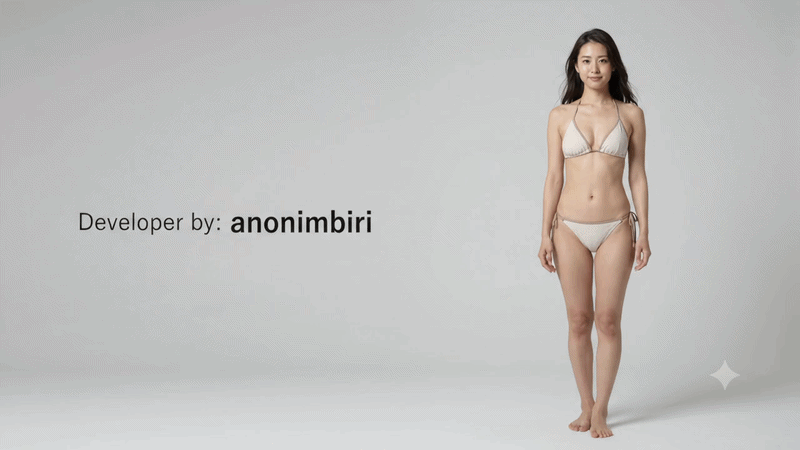

**✨ Free & Open Source Android Mod ✨**

---

## 🌸 Features

| Category | Features |
|:--------:|:---------|
| 👁️ **Vision** | `Unlimited Vision (Fog Hack)` `See Ghosts` `Remove Roof` `Drone View (5-25x Zoom)` |
| 🎯 **ESP** | `Player ESP` `Lines` `Box` `Distance` `Names` `Edge Indicators` `Hide in Vote/Lobby` |
| ⚡ **Utility** | `No Vent Cooldown` `Auto Complete Tasks` `Remote Call Emergency` |
| 🚀 **Movement** | `Set Position` `Teleport to Saved` `Teleport to Coordinates` `Speed Hack` |
| 🛠️ **Debug** | `Debug Overlay` `Player Info` `Position Tracking` `Entity Dump` |
| 🧪 **Experimental** | `Anti-Death (Local)` |

---

## 🎨 ESP Colors & Indicators

| Color | Role / Status |
|:-----:|:-----|
| 💠 **Cyan** | Local Player (You) |
| ⚪ **White** | Innocent (Goose, etc.) |
| 🔴 **Red** | Killers (Duck, Assassin, Professional, etc.) |
| 🟢 **Green** | Neutral Killers (Pelican, Vulture) |
| 🟠 **Orange** | Neutrals (Pigeon, Falcon) |
| 🟡 **Yellow** | Dodo / Dueling Dodo |
| ⚫ **Gray** | Ghosts / Dead Players |

**Special Indicators:**
- 🦠 **Bio Icon:** Player is Infected
- 💣 **Bomb Icon:** Player has a Bomb
- **Flags:** `[K]` Killed this round, `[V]` In Vent, `[I]` Invisible, `[M]` Morphed

---

## ⚡ Offset Auto-Updater

Want to update offsets for a new game patch? Check out our automated Python tool:

👉 [**Read the Offset Auto-Updater Tutorial (`TUTORIAL.md`)**](./OFFSET_TUTORIAL.md)

---

## 📥 Installation

1. Go to [**Releases**](https://github.com/GameSketchers/Goose-Goose-Duck-Android-Mod/releases)
2. Download latest **APK**
3. Install & Play! (Grant Overlay permissions if asked)

---

## ⚠️ Disclaimer

> **This project is made for EDUCATIONAL PURPOSES ONLY.**
> 
> Using mods in online games may result in bans.
> We are not responsible for any consequences.

---

**Made with 💜 by [anonimbiri](https://github.com/anonimbiri-IsBack)**

